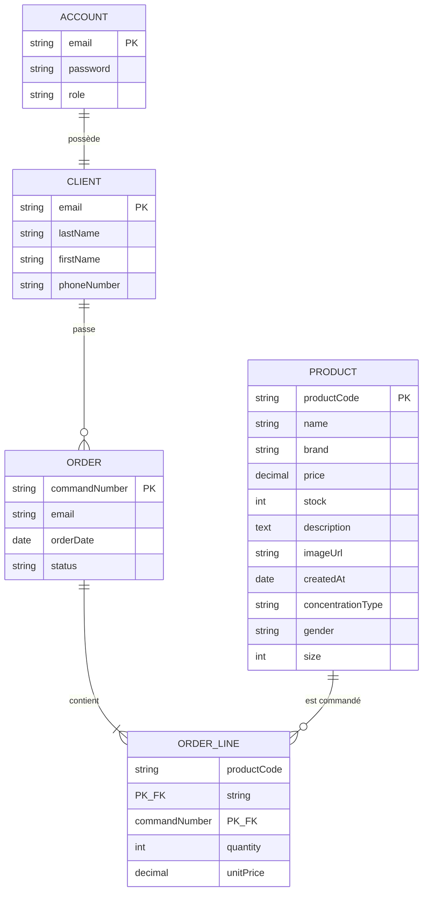

# Modèle Conceptuel de Données (MCD)

## Diagramme Entité-Association

## Description des entités

### ACCOUNT (Compte)
Gère l'authentification des utilisateurs.
- **email** : Identifiant unique (clé primaire)
- **password** : Mot de passe hashé (BCrypt)
- **role** : CLIENT ou ADMIN

### CLIENT
Informations personnelles des clients.
- **email** : Clé primaire
- **lastName** : Nom de famille
- **firstName** : Prénom
- **phoneNumber** : Téléphone (optionnel)

### PRODUCT (Produit)
Catalogue des parfums.
- **productCode** : Code unique au format XXX-TTT-MMM-YYYY
- **name** : Nom du parfum
- **brand** : Marque
- **price** : Prix en euros
- **stock** : Quantité disponible
- **concentrationType** : Eau de Parfum, Eau de Toilette, Extrait, Eau de Cologne
- **gender** : Homme, Femme, Mixte
- **size** : Contenance en ml

### ORDER (Commande)
Commandes passées par les clients.
- **commandNumber** : Numéro unique de commande
- **orderDate** : Date de la commande
- **status** : PENDING, COMPLETED, CANCELLED

### ORDER_LINE (Ligne de commande)
Détail des produits dans chaque commande.
- Clé primaire composite : (productCode, commandNumber)
- **quantity** : Quantité commandée
- **unitPrice** : Prix unitaire au moment de l'achat

## Cardinalités

| Relation | Cardinalité | Description |
|----------|-------------|-------------|
| ACCOUNT - CLIENT | 1:1 | Un compte correspond à un seul client |
| CLIENT - ORDER | 1:N | Un client peut passer plusieurs commandes |
| ORDER - ORDER_LINE | 1:N | Une commande contient plusieurs lignes |
| PRODUCT - ORDER_LINE | 1:N | Un produit peut apparaître dans plusieurs commandes |