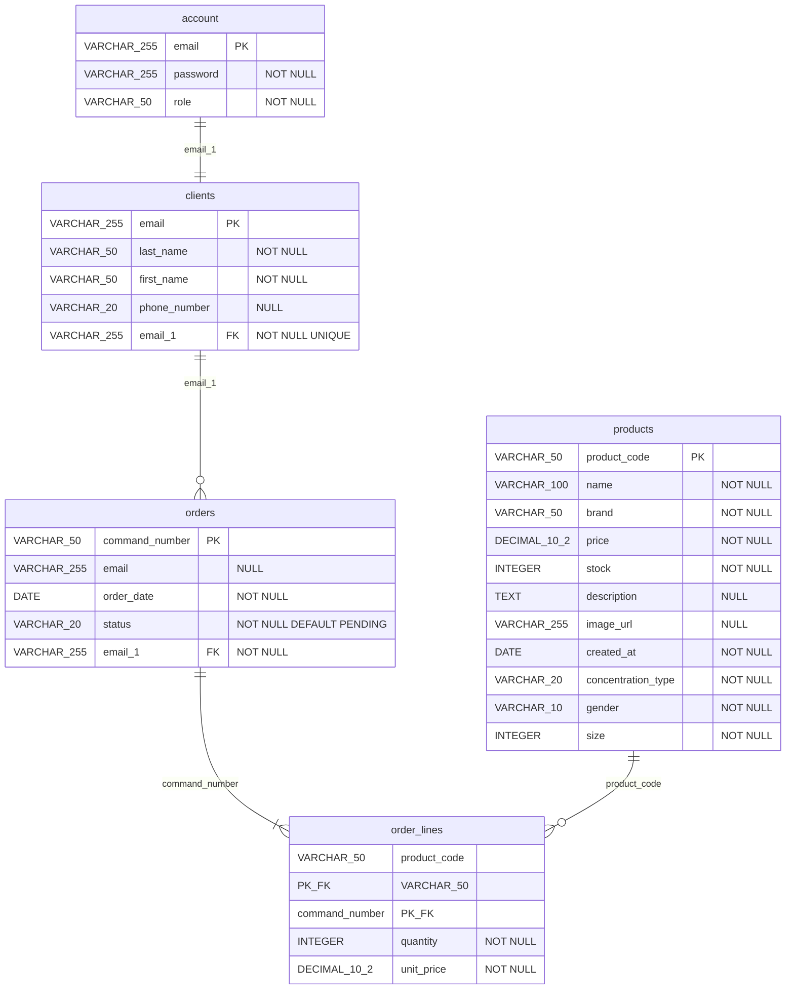

# Modèle Logique de Données (MLD)

## Schéma relationnel



## Notation textuelle

```
account (email, password, role)
    PK: email

clients (email, last_name, first_name, phone_number, #email_1)
    PK: email
    FK: email_1 REFERENCES account(email) ON DELETE CASCADE

products (product_code, name, brand, price, stock, description, image_url, created_at, concentration_type, gender, size)
    PK: product_code

orders (command_number, email, order_date, status, #email_1)
    PK: command_number
    FK: email_1 REFERENCES clients(email) ON DELETE RESTRICT

order_lines (#product_code, #command_number, quantity, unit_price)
    PK: (product_code, command_number)
    FK: product_code REFERENCES products(product_code) ON DELETE RESTRICT
    FK: command_number REFERENCES orders(command_number) ON DELETE CASCADE
```

## Détail des tables

### Table `account`
| Colonne | Type | Contraintes |
|---------|------|-------------|
| email | VARCHAR(255) | PRIMARY KEY |
| password | VARCHAR(255) | NOT NULL |
| role | VARCHAR(50) | NOT NULL, CHECK (role IN ('CLIENT', 'ADMIN')) |

### Table `clients`
| Colonne | Type | Contraintes |
|---------|------|-------------|
| email | VARCHAR(255) | PRIMARY KEY |
| last_name | VARCHAR(50) | NOT NULL |
| first_name | VARCHAR(50) | NOT NULL |
| phone_number | VARCHAR(20) | NULL |
| email_1 | VARCHAR(255) | NOT NULL, UNIQUE, FK → account(email) |

### Table `products`
| Colonne | Type | Contraintes |
|---------|------|-------------|
| product_code | VARCHAR(50) | PRIMARY KEY |
| name | VARCHAR(100) | NOT NULL |
| brand | VARCHAR(50) | NOT NULL |
| price | DECIMAL(10,2) | NOT NULL, CHECK (price >= 0) |
| stock | INTEGER | NOT NULL, CHECK (stock >= 0) |
| description | TEXT | NULL |
| image_url | VARCHAR(255) | NULL |
| created_at | DATE | NOT NULL |
| concentration_type | VARCHAR(20) | NOT NULL, CHECK IN ('Eau de Parfum', 'Eau de Toilette', 'Extrait', 'Eau de Cologne') |
| gender | VARCHAR(10) | NOT NULL, CHECK IN ('Homme', 'Femme', 'Mixte') |
| size | INTEGER | NOT NULL, CHECK (size > 0) |

### Table `orders`
| Colonne | Type | Contraintes |
|---------|------|-------------|
| command_number | VARCHAR(50) | PRIMARY KEY |
| email | VARCHAR(255) | NULL |
| order_date | DATE | NOT NULL |
| status | VARCHAR(20) | NOT NULL, DEFAULT 'PENDING', CHECK IN ('PENDING', 'COMPLETED', 'CANCELLED') |
| email_1 | VARCHAR(255) | NOT NULL, FK → clients(email) |

### Table `order_lines`
| Colonne | Type | Contraintes |
|---------|------|-------------|
| product_code | VARCHAR(50) | PK, FK → products(product_code) |
| command_number | VARCHAR(50) | PK, FK → orders(command_number) |
| quantity | INTEGER | NOT NULL, CHECK (quantity > 0) |
| unit_price | DECIMAL(10,2) | NOT NULL, CHECK (unit_price >= 0) |

## Index

| Table | Index | Colonnes |
|-------|-------|----------|
| products | idx_products_brand | brand |
| products | idx_products_gender | gender |
| products | idx_products_created_at | created_at DESC |
| orders | idx_orders_client | email_1 |
| orders | idx_orders_status | status |
| orders | idx_orders_date | order_date DESC |

## Règles de gestion

1. **Authentification** : Un compte est obligatoire pour être client
2. **Unicité** : Un email = un compte = un client
3. **Suppression client** : Impossible si des commandes existent (RESTRICT)
4. **Suppression commande** : Supprime automatiquement les lignes (CASCADE)
5. **Stock** : Doit rester positif ou nul
6. **Prix** : Doit être positif ou nul