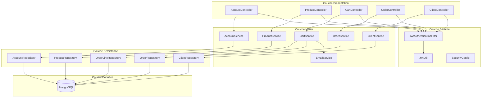
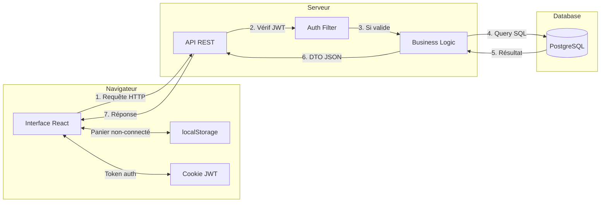
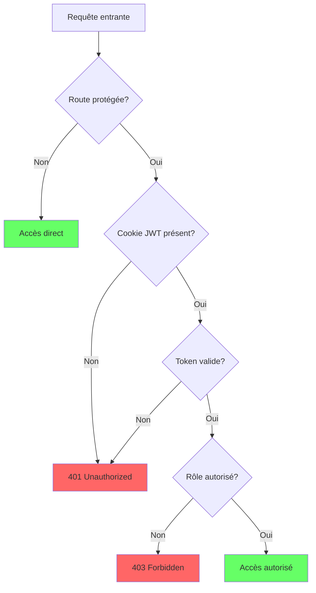

# Architecture Globale

## Vue d'ensemble

```
┌─────────────────────────────────────────────────────────────────────────────┐
│                              UTILISATEURS                                    │
│                    👤 Client    👤 Visiteur    👤 Admin                      │
└─────────────────────────────────────────────────────────────────────────────┘
                                      │
                                      ▼
┌─────────────────────────────────────────────────────────────────────────────┐
│                           FRONTEND (React)                                   │
│  ┌─────────────────────────────────────────────────────────────────────┐    │
│  │                         React 18 + TypeScript                        │    │
│  │  ┌──────────┐  ┌──────────┐  ┌──────────┐  ┌──────────────────┐    │    │
│  │  │  Pages   │  │Components│  │  Hooks   │  │ Context (Cart)   │    │    │
│  │  └──────────┘  └──────────┘  └──────────┘  └──────────────────┘    │    │
│  │  ┌──────────────────────────────────────────────────────────────┐  │    │
│  │  │                    Services (API calls)                       │  │    │
│  │  └──────────────────────────────────────────────────────────────┘  │    │
│  └─────────────────────────────────────────────────────────────────────┘    │
│                              Vite (Build)                                    │
│                           Port: 5173 (dev)                                   │
└─────────────────────────────────────────────────────────────────────────────┘
                                      │
                              HTTP/REST + JWT Cookie
                                      │
                                      ▼
┌─────────────────────────────────────────────────────────────────────────────┐
│                         BACKEND (Spring Boot)                                │
│  ┌─────────────────────────────────────────────────────────────────────┐    │
│  │                      Spring Boot 3 + Java 17                         │    │
│  │                                                                      │    │
│  │  ┌────────────────┐     ┌─────────────────────────────────────┐     │    │
│  │  │   Security     │     │           REST Controllers          │     │    │
│  │  │  JWT Filter    │────▶│  Account│Product│Order│Cart│Client  │     │    │
│  │  │  CORS Config   │     └─────────────────────────────────────┘     │    │
│  │  └────────────────┘                      │                          │    │
│  │                                          ▼                          │    │
│  │                         ┌─────────────────────────────────────┐     │    │
│  │                         │            Services                  │     │    │
│  │                         │  Account│Product│Order│Cart│Email   │     │    │
│  │                         └─────────────────────────────────────┘     │    │
│  │                                          │                          │    │
│  │                                          ▼                          │    │
│  │                         ┌─────────────────────────────────────┐     │    │
│  │                         │          Repositories (JPA)         │     │    │
│  │                         └─────────────────────────────────────┘     │    │
│  └─────────────────────────────────────────────────────────────────────┘    │
│                                Port: 8081                                    │
└─────────────────────────────────────────────────────────────────────────────┘
                                      │
                                 JDBC + JPA
                                      │
                                      ▼
┌─────────────────────────────────────────────────────────────────────────────┐
│                           BASE DE DONNÉES                                    │
│  ┌─────────────────────────────────────────────────────────────────────┐    │
│  │                         PostgreSQL 17                                │    │
│  │  ┌──────────┐ ┌──────────┐ ┌──────────┐ ┌──────────┐ ┌───────────┐ │    │
│  │  │ account  │ │ clients  │ │ products │ │  orders  │ │order_lines│ │    │
│  │  └──────────┘ └──────────┘ └──────────┘ └──────────┘ └───────────┘ │    │
│  └─────────────────────────────────────────────────────────────────────┘    │
│                              Port: 5432                                      │
└─────────────────────────────────────────────────────────────────────────────┘
                                      │
                                      │
┌─────────────────────────────────────────────────────────────────────────────┐
│                          SERVICES EXTERNES                                   │
│              ┌──────────────────────────────────────┐                       │
│              │         📧 SMTP (Gmail)              │                       │
│              │    Envoi emails de confirmation      │                       │
│              └──────────────────────────────────────┘                       │
└─────────────────────────────────────────────────────────────────────────────┘
```

## Architecture en couches (Backend)



## Stack Technique

### Frontend
| Technologie | Version | Rôle |
|-------------|---------|------|
| React | 18.x | Framework UI |
| TypeScript | 5.x | Typage statique |
| Vite | 5.x | Build tool |
| React Router | 6.x | Routing SPA |
| Axios | 1.x | Client HTTP |
| CSS Modules | - | Styles scopés |

### Backend
| Technologie | Version | Rôle |
|-------------|---------|------|
| Java | 17 | Langage |
| Spring Boot | 3.x | Framework |
| Spring Security | 6.x | Sécurité |
| Spring Data JPA | 3.x | ORM |
| JWT (jjwt) | 0.12.x | Tokens |
| Lombok | 1.18.x | Réduction boilerplate |
| Maven | 3.9.x | Build |

### Base de données
| Technologie | Version | Rôle |
|-------------|---------|------|
| PostgreSQL | 17.x | SGBD relationnel |

### Outils
| Outil | Rôle |
|-------|------|
| Git | Versioning |
| GitHub | Repository |
| Postman | Tests API |
| pgAdmin | Admin BDD |

## Flux de données



## Sécurité

