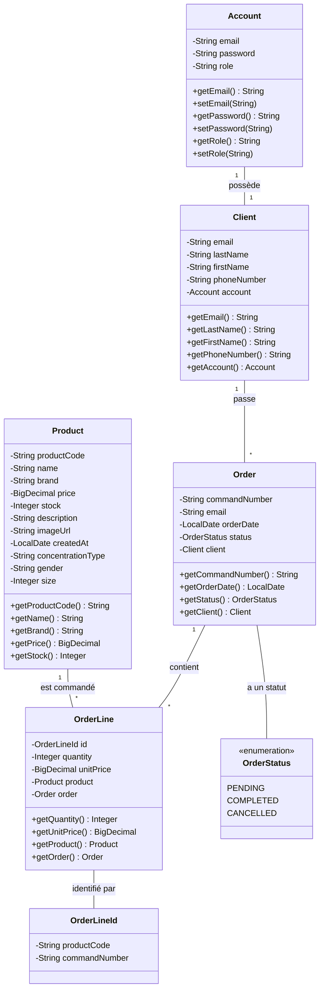
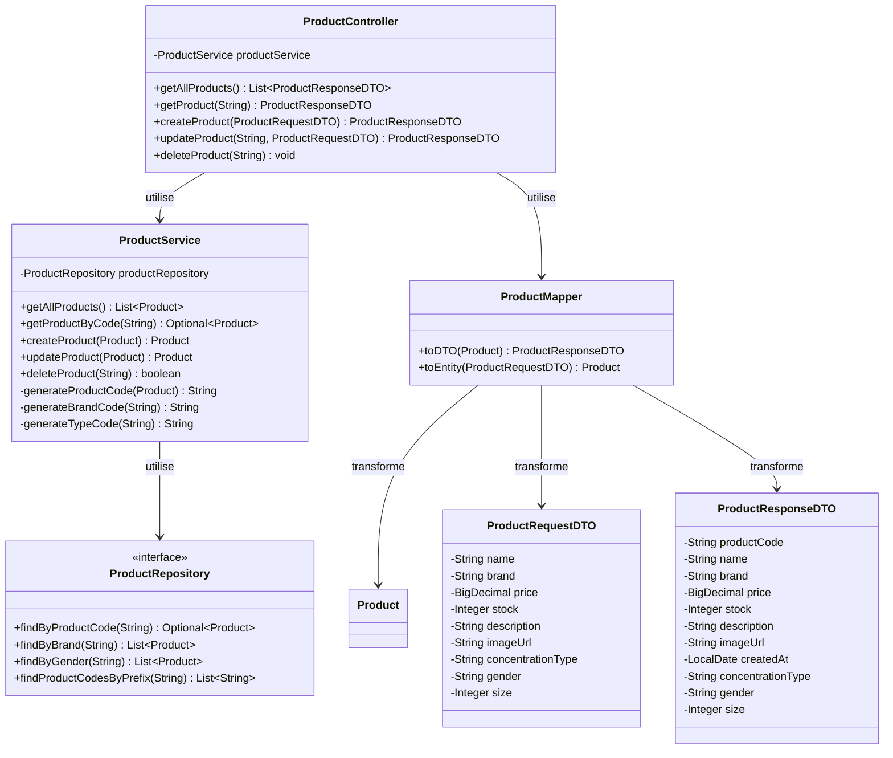
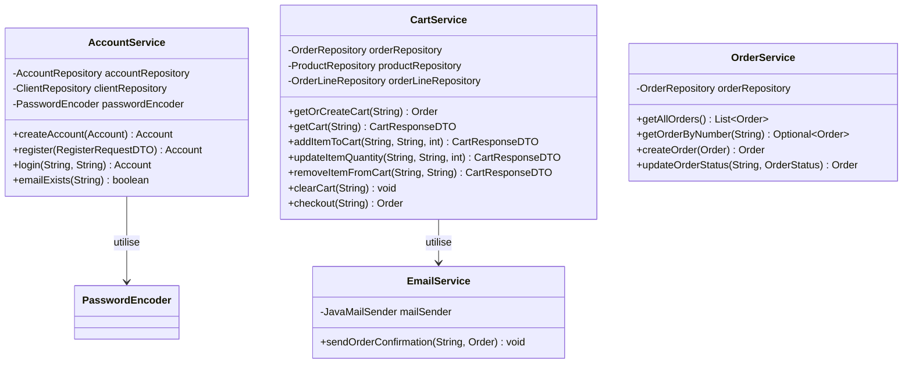
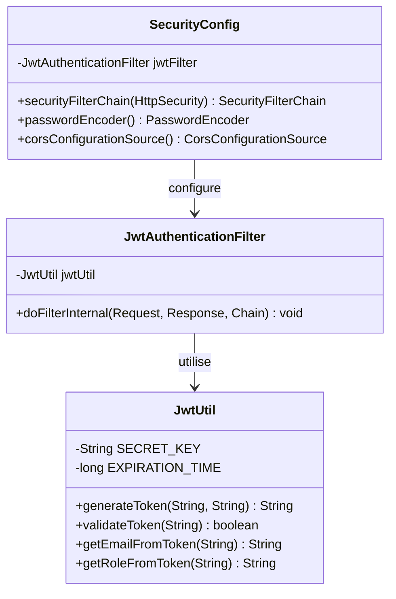

# Diagramme de Classes

## Entités (Domain Model)

```mermaid
classDiagram
    class Account {
        -String email
        -String password
        -String role
        +getEmail() String
        +setEmail(String)
        +getPassword() String
        +setPassword(String)
        +getRole() String
        +setRole(String)
    }

    class Client {
        -String email
        -String lastName
        -String firstName
        -String phoneNumber
        -Account account
        +getEmail() String
        +getLastName() String
        +getFirstName() String
        +getPhoneNumber() String
        +getAccount() Account
    }

    class Product {
        -String productCode
        -String name
        -String brand
        -BigDecimal price
        -Integer stock
        -String description
        -String imageUrl
        -LocalDate createdAt
        -String concentrationType
        -String gender
        -Integer size
        +getProductCode() String
        +getName() String
        +getBrand() String
        +getPrice() BigDecimal
        +getStock() Integer
    }

    class Order {
        -String commandNumber
        -String email
        -LocalDate orderDate
        -OrderStatus status
        -Client client
        +getCommandNumber() String
        +getOrderDate() LocalDate
        +getStatus() OrderStatus
        +getClient() Client
    }

    class OrderLine {
        -OrderLineId id
        -Integer quantity
        -BigDecimal unitPrice
        -Product product
        -Order order
        +getQuantity() Integer
        +getUnitPrice() BigDecimal
        +getProduct() Product
        +getOrder() Order
    }

    class OrderLineId {
        -String productCode
        -String commandNumber
    }

    class OrderStatus {
        <<enumeration>>
        PENDING
        COMPLETED
        CANCELLED
    }

    Account "1" -- "1" Client : possède
    Client "1" -- "*" Order : passe
    Order "1" -- "*" OrderLine : contient
    Product "1" -- "*" OrderLine : est commandé
    Order -- OrderStatus : a un statut
    OrderLine -- OrderLineId : identifié par
```

## Architecture en couches

```mermaid
classDiagram
    direction TB

    class ProductController {
        -ProductService productService
        +getAllProducts() List~ProductResponseDTO~
        +getProduct(String) ProductResponseDTO
        +createProduct(ProductRequestDTO) ProductResponseDTO
        +updateProduct(String, ProductRequestDTO) ProductResponseDTO
        +deleteProduct(String) void
    }

    class ProductService {
        -ProductRepository productRepository
        +getAllProducts() List~Product~
        +getProductByCode(String) Optional~Product~
        +createProduct(Product) Product
        +updateProduct(Product) Product
        +deleteProduct(String) boolean
        -generateProductCode(Product) String
        -generateBrandCode(String) String
        -generateTypeCode(String) String
    }

    class ProductRepository {
        <<interface>>
        +findByProductCode(String) Optional~Product~
        +findByBrand(String) List~Product~
        +findByGender(String) List~Product~
        +findProductCodesByPrefix(String) List~String~
    }

    class ProductMapper {
        +toDTO(Product) ProductResponseDTO
        +toEntity(ProductRequestDTO) Product
    }

    class ProductRequestDTO {
        -String name
        -String brand
        -BigDecimal price
        -Integer stock
        -String description
        -String imageUrl
        -String concentrationType
        -String gender
        -Integer size
    }

    class ProductResponseDTO {
        -String productCode
        -String name
        -String brand
        -BigDecimal price
        -Integer stock
        -String description
        -String imageUrl
        -LocalDate createdAt
        -String concentrationType
        -String gender
        -Integer size
    }

    ProductController --> ProductService : utilise
    ProductController --> ProductMapper : utilise
    ProductService --> ProductRepository : utilise
    ProductMapper --> Product : transforme
    ProductMapper --> ProductRequestDTO : transforme
    ProductMapper --> ProductResponseDTO : transforme
```

## Services

```mermaid
classDiagram
    class AccountService {
        -AccountRepository accountRepository
        -ClientRepository clientRepository
        -PasswordEncoder passwordEncoder
        +createAccount(Account) Account
        +register(RegisterRequestDTO) Account
        +login(String, String) Account
        +emailExists(String) boolean
    }

    class CartService {
        -OrderRepository orderRepository
        -ProductRepository productRepository
        -OrderLineRepository orderLineRepository
        +getOrCreateCart(String) Order
        +getCart(String) CartResponseDTO
        +addItemToCart(String, String, int) CartResponseDTO
        +updateItemQuantity(String, String, int) CartResponseDTO
        +removeItemFromCart(String, String) CartResponseDTO
        +clearCart(String) void
        +checkout(String) Order
    }

    class EmailService {
        -JavaMailSender mailSender
        +sendOrderConfirmation(String, Order) void
    }

    class OrderService {
        -OrderRepository orderRepository
        +getAllOrders() List~Order~
        +getOrderByNumber(String) Optional~Order~
        +createOrder(Order) Order
        +updateOrderStatus(String, OrderStatus) Order
    }

    AccountService --> PasswordEncoder : utilise
    CartService --> EmailService : utilise
```

## Configuration Sécurité

```mermaid
classDiagram
    class SecurityConfig {
        -JwtAuthenticationFilter jwtFilter
        +securityFilterChain(HttpSecurity) SecurityFilterChain
        +passwordEncoder() PasswordEncoder
        +corsConfigurationSource() CorsConfigurationSource
    }

    class JwtUtil {
        -String SECRET_KEY
        -long EXPIRATION_TIME
        +generateToken(String, String) String
        +validateToken(String) boolean
        +getEmailFromToken(String) String
        +getRoleFromToken(String) String
    }

    class JwtAuthenticationFilter {
        -JwtUtil jwtUtil
        +doFilterInternal(Request, Response, Chain) void
    }

    SecurityConfig --> JwtAuthenticationFilter : configure
    JwtAuthenticationFilter --> JwtUtil : utilise
```