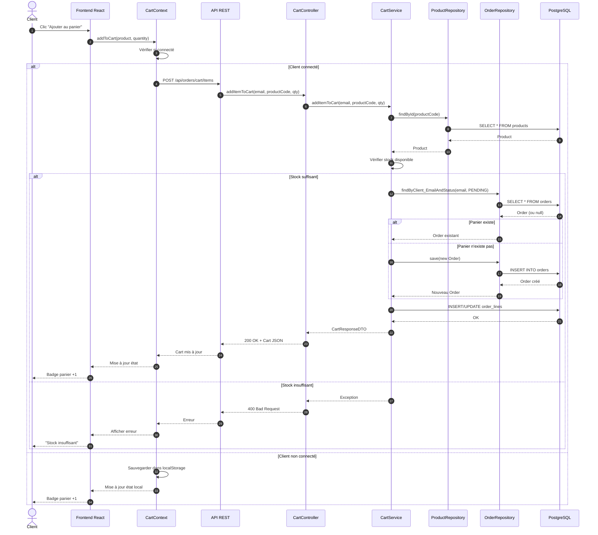
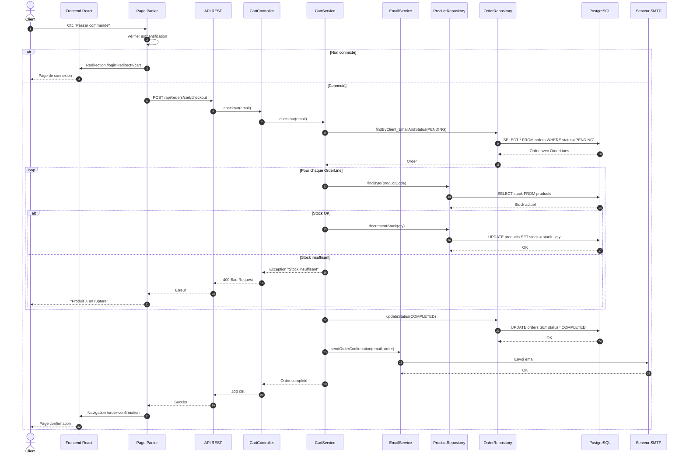
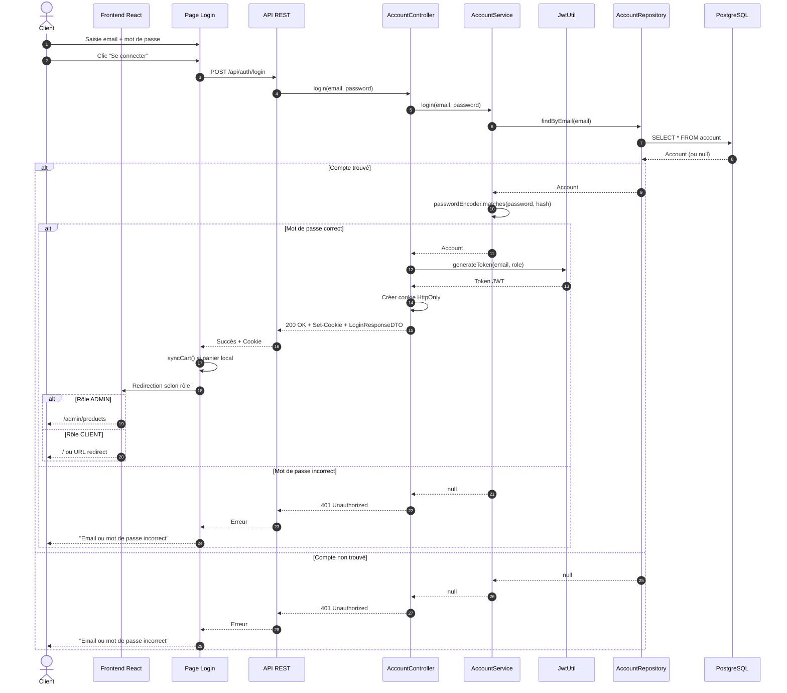

# Diagrammes de Séquence

## Fonctionnalité présentée : Ajouter au panier et passer commande

### 1. Ajouter un produit au panier (Client connecté)

### 2. Passer commande (Checkout)

### 3. Authentification (Login)

## Légende

| Symbole | Signification |
|---------|---------------|
| `->>`   | Appel synchrone |
| `-->>` | Réponse |
| `alt/else` | Alternative (condition) |
| `loop` | Boucle |
| `autonumber` | Numérotation automatique des étapes |