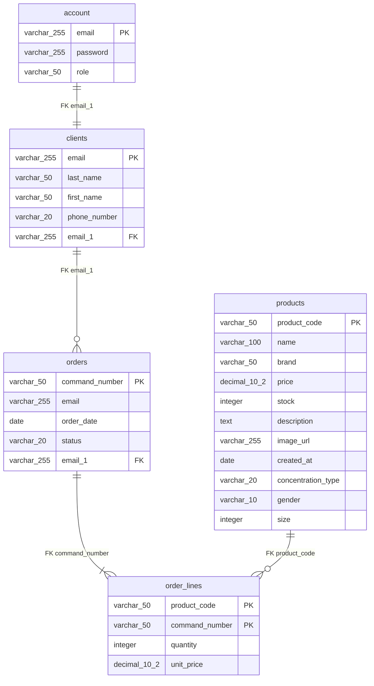

# Modèle Physique de Données (MPD)

## Schéma PostgreSQL



## Scripts DDL

### Table account
```sql
CREATE TABLE account (
    email VARCHAR(255) PRIMARY KEY,
    password VARCHAR(255) NOT NULL,
    role VARCHAR(50) NOT NULL CHECK (role IN ('CLIENT', 'ADMIN'))
);
```

### Table clients
```sql
CREATE TABLE clients (
    email VARCHAR(255) PRIMARY KEY,
    last_name VARCHAR(50) NOT NULL,
    first_name VARCHAR(50) NOT NULL,
    phone_number VARCHAR(20),
    email_1 VARCHAR(255) NOT NULL UNIQUE,
    FOREIGN KEY (email_1) REFERENCES account(email) ON DELETE CASCADE
);
```

### Table products
```sql
CREATE TABLE products (
    product_code VARCHAR(50) PRIMARY KEY,
    name VARCHAR(100) NOT NULL,
    brand VARCHAR(50) NOT NULL,
    price DECIMAL(10,2) NOT NULL CHECK (price >= 0),
    stock INTEGER NOT NULL CHECK (stock >= 0),
    description TEXT,
    image_url VARCHAR(255),
    created_at DATE NOT NULL,
    concentration_type VARCHAR(20) NOT NULL,
    gender VARCHAR(10) NOT NULL CHECK (gender IN ('Homme', 'Femme', 'Mixte')),
    size INTEGER NOT NULL CHECK (size > 0)
);
```

### Table orders
```sql
CREATE TABLE orders (
    command_number VARCHAR(50) PRIMARY KEY,
    email VARCHAR(255),
    order_date DATE NOT NULL,
    status VARCHAR(20) NOT NULL DEFAULT 'PENDING' CHECK (status IN ('PENDING', 'COMPLETED', 'CANCELLED')),
    email_1 VARCHAR(255) NOT NULL,
    FOREIGN KEY (email_1) REFERENCES clients(email) ON DELETE RESTRICT
);
```

### Table order_lines
```sql
CREATE TABLE order_lines (
    product_code VARCHAR(50),
    command_number VARCHAR(50),
    quantity INTEGER NOT NULL CHECK (quantity > 0),
    unit_price DECIMAL(10,2) NOT NULL CHECK (unit_price >= 0),
    PRIMARY KEY (product_code, command_number),
    FOREIGN KEY (product_code) REFERENCES products(product_code) ON DELETE RESTRICT,
    FOREIGN KEY (command_number) REFERENCES orders(command_number) ON DELETE CASCADE
);
```

## Index de performance
```sql
CREATE INDEX idx_products_brand ON products(brand);
CREATE INDEX idx_products_gender ON products(gender);
CREATE INDEX idx_products_created_at ON products(created_at DESC);
CREATE INDEX idx_orders_client ON orders(email_1);
CREATE INDEX idx_orders_status ON orders(status);
CREATE INDEX idx_orders_date ON orders(order_date DESC);
```